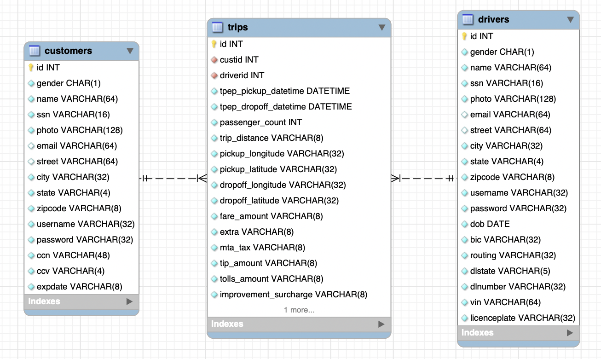

# Elite Cars

## Background

Elite cars is a new start up that launched in New York just over a month ago. It offers an elite car ride service for the rich and famous and guarantees anonymity and total discretion.

It has captured the imagination of those it was trying to attract and in the first month it has over 4000 very well known people signed up as customers that have already taken over 100,000 trips.

With the amazing success the founding team are already being asked to immediately expand into other major cities, both in North America but also all over the world. They realize that they have a head start but others will copy their plan and unless they can move quickly they may lose their market advantage.

However they are very worried. Their whole business is dependant on the keeping the identities and knowlege of their clients completely confidential and suddenly the whole world is interested in knowing who their customers are and especially where they are going. Nobody in the founding team has any experience in data security or privacy, and nobody has focused on anything other than building a working system to see if people will use it.

## You - The Data Privacy Leader

To avoid potential catastrophe and to avoid delaying their expansion into more cities, domestically and internationally, they have brought **you** in as their chosen data privacy and security expert to remove any potential problems, unknowns and future risks.

From a third party perspective, they tell you they have used federated login to simplify the signup and, [Google Maps SDK](https://developers.google.com/maps/documentation) to display mapping information and for site analytics they use [Google Analytics](https://marketingplatform.google.com/about/analytics/) and [Google Firebase for augmented analytics understanding](https://firebase.google.com/products/analytics). They are not aware of any other 3rd party dependancies other than AWS for hosting of database and app executables.

They are aware of the existing mysql database structure and they have given you the mysql root user and password, which is the only credential that they know exists. They tell you the data currently resides in an AWS US-East-1 RDS database.

They tell you that to their knowledge, this is the only data that exists, that there are 300 drivers, nearly 4100 registrated celebrities that have taken 100,000 trips to date. You know Elite Cars have a massive problem when they gave you the mysql root password of 'root' and you immediately could access Mel Gibson's password in the clear. Here are examples of the records you found.

Because of the short time to market there is no product documentation whatsover.

Your job is to apply all of your skills and training to transform Elite Cars' data management and privacy implementation into a sustainable platform, to ensure rapid growth and minimized risk for the company. If you can achieve this you know you will be very wealthy and also be in high demand in all other companies with similar probems...

[Data Protocol](https://dataprotocol.com) is here to help guide you through your necessary journey and make sure you are never alone.

## Build Modern Data Management and Privacy (Be a Data Master!)

1. PII Identification and Classification Master
2. Data Discovery Master
3. Data Minimisation Master
4. Data Storage Master
5. Data Access Master
6. Data Logging Master
7. Data Security Master
8. Data Anonymization Master
9. 3PP SDK Master

## Advanced Scenarios

Elite Cars cannot thank you enough, you have enabled them to avoid catastrophic breach and penalties and also reduce their operating costs. They have promoted you to the executive team and are now wanting to expand the business and they need your help again.

### Internal Business Analytics

Demand is so high in New York that they are needing to expand the number of drivers, but they want to do this intelligently to recruit drivers that live close to the actual demand. This way they enable their drivers to perform more trips and also reduce wait times for their customers, who are very short on patience. But the tabloid press are still trying to infiltrate Elite Cars to get dirt on their very exclusive customers and a perfect way to learn who they are is by getting a job as a business analyst inside the company. The only reason the customers are anonymous today is because of your fine work. Your fellow executive team is now asking you to enable operations and internal data sharing so the data analytics teams can run their models on the real data but never know anything about any existing customers or drivers. Remember - if they know the drivers then they can also start stalking them!

### Government Access to Data

You have received a request to share all your drive data details with the local authorities. This is a requirement placed on all companies operating vehicles for hire, to enable the cities and state to make improvement plans for future transportation investments and policy. You are forced to share data but you cannot compromise any confidentiality of either your customers or drivers with this request.

### International Expansion

The investors will not wait any longer and Elite Cars has to launch in Paris in the next quarter. The executive team has asked you to ensure that with international expansion there is no compromise to any of the implemented privacy and security and that Elite Cars complies with all required regulation.

### Elite Targeted Advertising

Elite Cars CEO has been speaking to your leading customers and they tell her they would be happy if the service included targeted, relevant advertising, as long as it did not compromise any of their privacy and anonymity. Elite Cars has incredible first party data on the wealthiest population on the planet and the investors want to monetize that assett in a tremendously exclusive way. Your CEO understands that if any data is compromised then Elite Cars will fold overnight. She has personally tasked you with the mission of building an operation where syuch compromise will not be possible.
